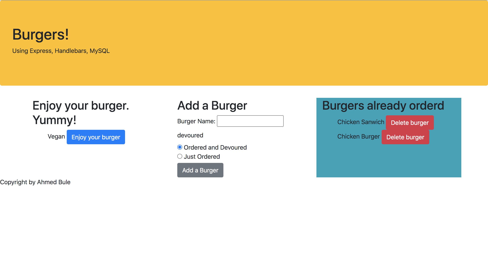

# burger-

### Description: 
Eat-Da-Burger! is a restaurant app that lets users input the names of burgers they'd like to eat.

Whenever a user submits a burger's name, your app will display the burger on the left side of the page -- waiting to be devoured.

Each burger in the waiting area also has a Devour it! button. When the user clicks it, the burger will move to the right side of the page.

## Features: 

## Click here to see the link: 

[Burger App Link](https://mighty-meadow-74253.herokuapp.com/)

## Application Set-up: 
Install the Express npm package: npm install express.

Create a server.js file.

Install the Handlebars npm package: npm install express-handlebars.

Install MySQL npm package: npm install mysql.

Require the following npm packages inside of the server.js file:

express

## License: 
(https://img.shields.io/badge/license-MIT-blue.svg)

## Contributing 
Ahmed Bule

## Questions: 
For any questions, feel free to email me at ahmedbule01@gmail.com
